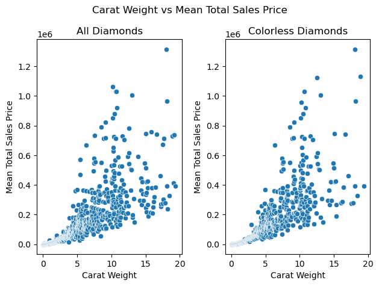
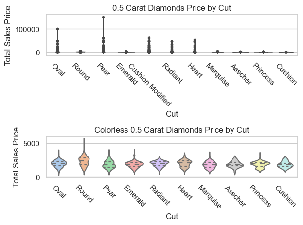
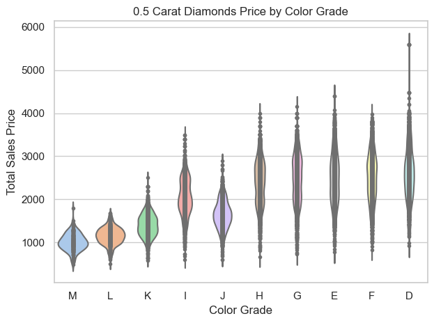
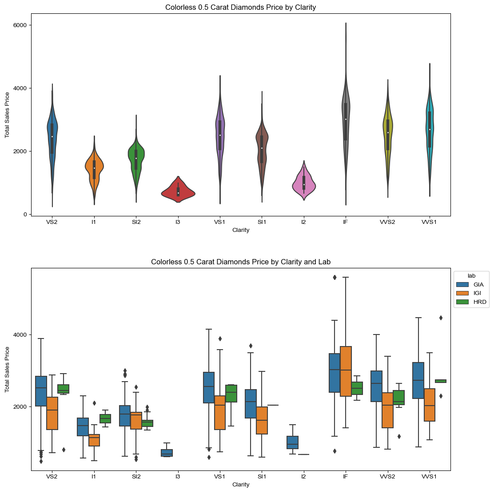
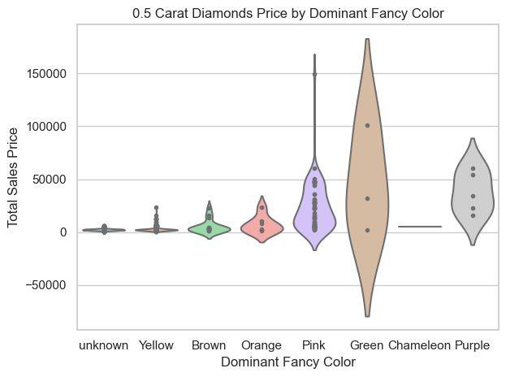
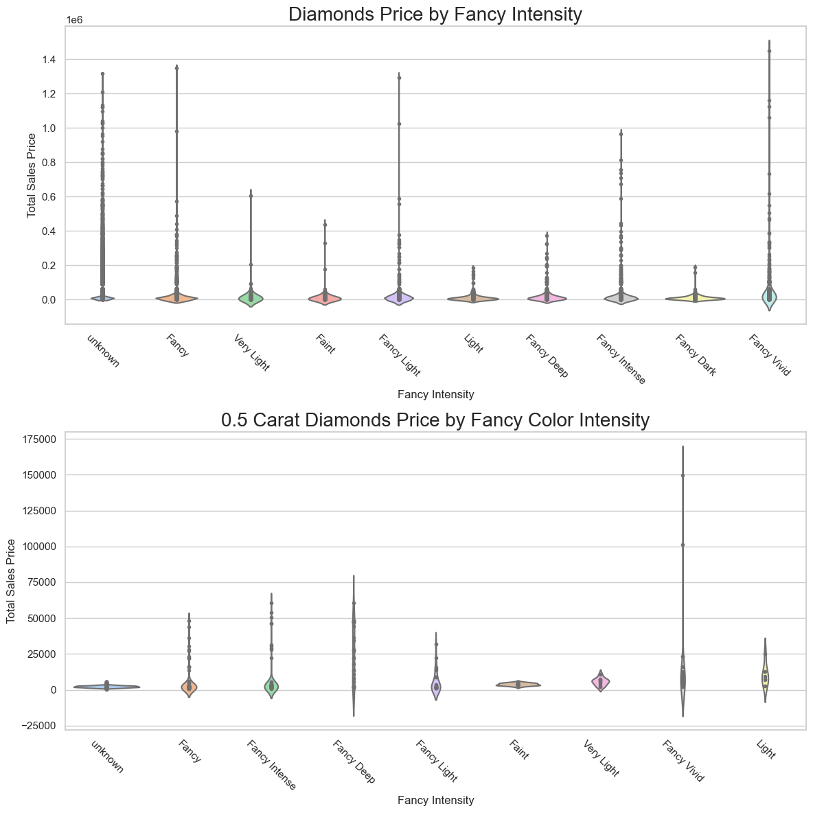
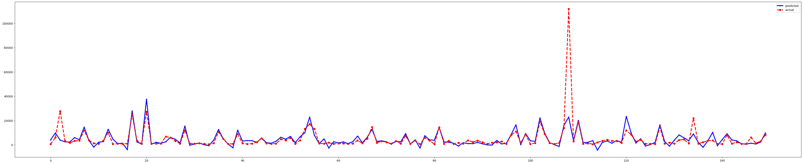
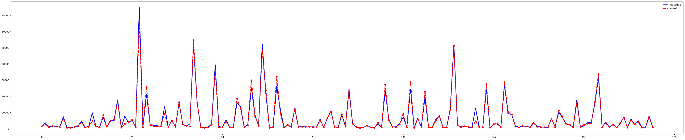

# **Diamond Price Prediction**

## **OVERVIEW**
This project aims to predict the sales price of diamonds using machine learning techniques. The project includes data preprocessing, feature engineering, model selection, and evaluation. 
Before that, Exploratory Data Analysis is performed to understand the data better as well as visualize any trends observed so we can perform data preprocessing accordingly.
The dataset contains information about diamonds, including their carat, cut, color, clarity, and more. The goal is to build a predictive model that can accurately estimate the sales price of a diamond based on its features.

## DATA
The dataset used for this project is the [Diamonds](https://www.kaggle.com/datasets/hrokrin/the-largest-diamond-dataset-currely-on-kaggle) dataset from kaggle. It is quite extensive with over 210,000 entries of diamonds containing 24 features, including the 4Cs(Carat, Cut, Color, Clarity), fancy color and more.

## EDA
This notebook performs an exploratory data analysis (EDA) on the diamonds sales dataset. The goal of this project is to gain a deeper understanding of the dataset, identify key trends and patterns, and extract insights that can inform future analysis or modeling efforts.

### Workflow
The EDA is performed using Python and various libraries, including Pandas, NumPy, and Matplotlib. The analysis includes:

1. Data cleaning: handling missing and duplicate values, removing outliers, and checking for inconsistent data.
2. Feature analysis: understanding individual features and their impact on the price of diamonds.
3. Visualization: creating plots and charts to illustrate key findings and trends.

###  Findings
The EDA reveals several key insights into the diamonds sales dataset, including:

- Relationship between Carat Weight and Price

    - Clearly, as the carat weight increases the price seems to increase as well(generally). For a diamond of carat between 0 and 5, the relation seems to be more linear than carat grater than 5 where it gets more scattered.
    - Also, we can see that the fancy color of a diamond plays an important role as the mean price for colorless diamonds plot is less scattered compared to when we take all diamonds into account.

- Distribution of diamond Cuts, Colors, and Clarities

    To analyse price vs the other features, data of diamonds of the median carat weight(0.5) is selected.

     

    - 
        - Round cut diamonds seem to be more expensive than other cuts of the same carat weight among clear diamonds.

     

    - 
        - Diamonds with a noticeable color (K-M) are less expensive than colorless and near colorless diamonds.

        - Density of K-M diamonds is also the highest among the rest, which shows the supply and demand is high for them compared to the more expensive diamonds which checks out.

     

    - 
        - We can see that diamonds with higher clarity grades (IF, VVS1, VVS2, VS1, VS2) tend to be more expensive than those with lower clarity grades.
        - I2 and I3 clarities are priced significantly lower than compared to others. While we can definetly observe a difference in median price among the rest, its not as much as between I1 and (I2 and I3).

 

<!-- - Impact of cut quality on price -->
- Impact of a Fancy Color and its Intensity on Price
    - 
        - Fancy color diamonds are significantly more expensive than clear diamonds of the same carat weight
        - Among the fancy colors, Yellow and Brown are of relatively lower prices.

     

    - 
        - The price of fancy color diamonds increases as the intensity of the color increases.
        - Fancy Vivid and Fancy Intense fancy color diamonds are the most expensive.

### Conclusion
- After performing feature analysis, we can confirm that carat weight, cut, fancy color, fancy color intensity impact the Sales Price among some of the other fetures such as Measured Depth, Width and Length.

|feature|                       value|
|----------|------------|
|total_sales_price          |   1.000000|
|carat_weight               |   0.745154|
|meas_depth                 |   0.542327|
|meas_width                 |   0.541605|
|meas_length                |   0.509540|
|cut                        |   0.115150|
|fancy_color_dominant_color |   0.113884|
|fancy_color_intensity      |   0.099142|
|cut_quality                |   0.093071|

- However, clarity and color fature importance values are on the lower side, even though we observed otherwise earlier. Therefore, the data needs to be preprocessed more to get a more accurate feature analysis.

|feature                     |   value|
|---|---|
|color                       |   0.058763|
|symmetry                    |   0.037486|
|girdle_max                  |   0.036604|
|depth_percent               |   0.034261|
|fancy_color_secondary_color |   0.030144|
|fluor_color                 |   0.029675|
|lab                         |   0.023366|
|culet_condition             |   0.021211|
|girdle_min                  |   0.018174|
|polish                      |   0.013938|
|fancy_color_overtone        |   0.008101|
|culet_size                  |   0.004624|
|clarity                     |   0.001368|

- We will take these obeservations into account when modeling.

 

## PREDICTIVE MODELING

### Data Preprocessing
To deal with the inconsistent feature importance values observed in the EDA, we are performing the data preprocessing step which involves cleaning and transforming the data. So before we preform handling missing values, encoding categorical variables, and scaling numerical variables, we will check for multicollinear. 

### Models
The project uses a variety of machine learning models to predict the sales price of diamonds. The models are trained on the preprocessed dataset and evaluated using cross-validation. The best model is selected where it shows the best performace based on the cross-validation errors, which turned out to be the Extra Trees Regressor model included in the sklearn library.

### Modeling Results

<!-- **Partial Dependence Plots** -->
**Feature Importance**

The partial dependence plots show the relationship between each feature and the predicted price.
- Carat: The predicted price increases as the carat weight increases, this is the feature that impacts the sales price the most.
- Cut: The predicted price is highest for diamonds with a cut grade of "Ideal".
- Color: The predicted price is highest for diamonds with a color grade of "D" for the colorless diamonds, which is still lower than their corresponding carat weight fancy colored diamonds. 
- Clarity: The predicted price is highest for diamonds with a clarity grade of "FL" but doesn't seem to a significant feature.
- Length: The predicted price increases as the measured length of a diamond increases. "While there is no direct correlation between a diamond’s measured length and its price, a longer diamond can appear more valuable due to its perceived size."

 

**Model Evaluation**

The model was evaluated using various metrics, including MAE, R-squared, and mean squared error (MSE), and was found to be robust and reliable.

The project achieves an R-squared of 0.87 on the test set. The model is able to predict the sales price of diamonds with a mean absolute error (MAE) of $931.43.

| Metric | Baseline Model Values | Best Model Values |
| --- | --- | --- |
| Mean Absolute Error (MAE) | $3,036.95 | $931.43 | 
| Root Mean Squared Error (RMSE) | $10,977.30 | $6,610.32 | 
| Coefficient of Determination (R-squared) | 0.6332 | 0.8669 |

We can see how the fit improves from our first basic model:
- Baseline model(Ridge)

- Final model after optimization

## Conclusion
This project aimed to develop a predictive model for diamond prices based on various characteristics, including carat, cut, color, and clarity. 
Through a comprehensive analysis of the data and the application of various machine learning algorithms, we achieved the following results:

- Best Performing Model: The Extra Trees Regressor model outperformed other models, achieving a mean absolute error (MAE) of $900 and a coefficient of determination (R-squared) of 0.85.
- Feature Importance: The model identified carat, cut, and color as the most important features in predicting diamond prices, with clarity also playing a significant role.

Based on these findings, uses in real life could be that:

- The model can be used by industry professionals to inform pricing strategies and by consumers to make more informed purchasing decisions.
- The identified feature importance can be used to inform future data collection and feature engineering efforts as well as be used in the deployment of the model.

## Future Work
There are several areas for future work in this project, including:
- Model Improvement: Exploration of alternative machine learning models and techniques to improve the model's performance.
- Build Dashboards: Creation of interactive Tableau dashboards to visualize the data and model results.
    - Diamond Market Analysis Dashboard: A dashboard that provides an overview of the diamond market, including trends and patterns in diamond prices.
    - Diamond Quality Analysis Dashboard: A dashboard that allows users to analyze the quality of diamonds based on various characteristics.
- Deployment: Deployment of the model to a web application or API for easy access to the diamond price prediction functionality.

## Resources Used
- Missing Values, https://www.geeksforgeeks.org/ml-handling-missing-values/
- Evaluation metrics for regression models, https://machinelearningmastery.com/regression-metrics-for-machine-learning/

